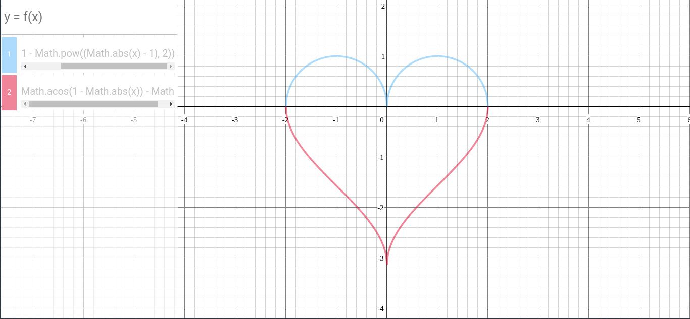
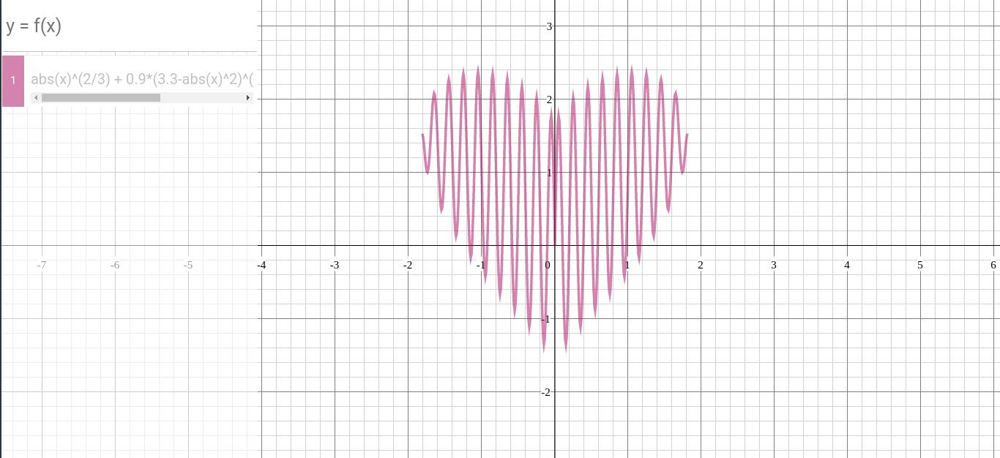

# Desmos

https://www.desmos.com/calculator clone with vanilla javascript, using for learning <b>Math</b> such as drawing graphs.

Written by <i>SilverbossTD</i> (duycntsilverboss@gmail.com).

Language: <b>Javascript</b>.

## How to use
To use, simply write the function in the input box and then press <b>Enter</b>

There are 2 interpretation types:

<details>
<summary>Javascript eval</summary>
   
```javascript
Math.sqrt(1 - Math.pow((Math.abs(x) - 1), 2))
Math.pow(x, 2/3) + Math.pow(0.9 * (3.3 - Math.pow(x, 2)), 1/2) * Math.sin(10 * Math.pi * x)
```
   
</details>

<details>
<summary>Math.js</summary>
   
```javascript
sqrt(1 - (abs(x) - 1)^2)
3x^2 - 5x + 9
```
   
</details>

## Some images


